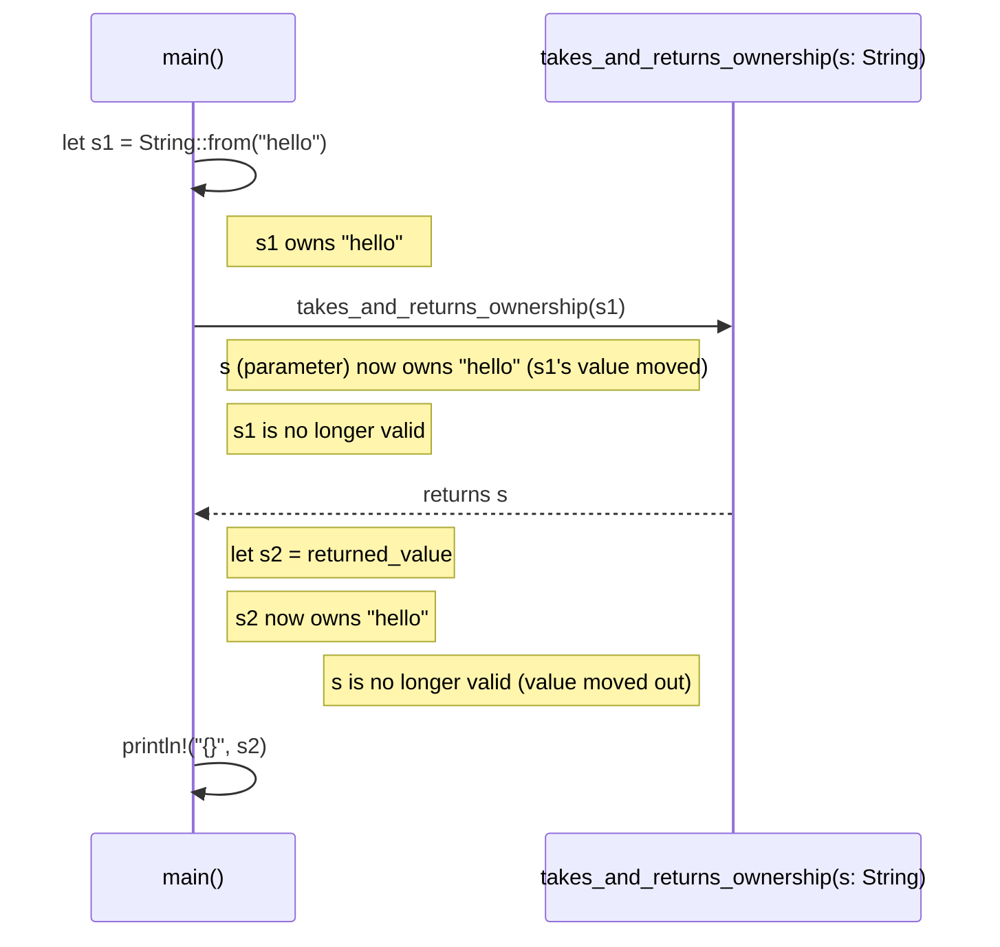

# Ownership

Allows memory safety without garbage collection.

Ownership is a set of rules that the Rust compiler checks at compile time to ensure memory safety.
If any of the rules are violated, the compiler will refuse to compile the code.

There are three main rules of ownership:

1. Each value in Rust has a variable that is its "owner".
2. A value can only have one owner at a time.
3. When the owner of a value goes out of scope, the value will be dropped (deallocated).

## Scopes

A scope is a region of code where a variable is valid.

```rust
fn main() {
  let x = 5; // x is valid in this scope
  {
    let y = 10; // y is valid in this inner scope
    println!("x: {}, y: {}", x, y); // both x and y are valid here
  } // y goes out of scope here, but x is still valid
  println!("x: {}", x); // x is still valid here
} // x goes out of scope here
```

## Memory Allocation

### Memory in Stack

```rust
let x = 5; // x is stored in the stack
let y = x; // y is a copy of x, both x and y are stored in the stack
```

Both `x` and `y` are stored in the stack, and they are independent of each other. Changing one does not affect the other.

### Memory in Heap

```rust
let s1 = String::from("hello"); // s1 is stored in the heap
let s2 = s1; // s2 takes ownership of the heap memory, s1 is no longer valid
```


```rust

let s1 = String::from("hello");
let s2 = s1;

println!("{s1}, world!"); // This will cause a compile-time error because s1 is no longer valid
```

### Cloning

`clone` is a method that creates a deep copy of the value, allowing multiple owners of the same data.

```rust
let s1 = String::from("hello");
let s2 = s1.clone(); // s2 is a deep copy of s1, both are valid
```

### Copy

The size of the data is known at compile time, and it is small enough to be stored on the stack.
Types that implement the `Copy` trait can be duplicated without transferring ownership.

```rust

let x = 5;
let y = x;

println!("x = {x}, y = {y}"); // This works because integers implement the Copy trait
```

## Ownership and Functions

When a value is passed to a function, ownership is transferred to the function.

```rust
fn main() {
  let s1 = String::from("hello");
  takes_ownership(s1); // s1 is moved into the function
  // println!("{}", s1); // This will cause a compile-time error because s1 is no longer valid
}

fn takes_ownership(s: String) {
  println!("{}", s); // s is valid here
} // s goes out of scope and is dropped here
```

### Returning Values

When a function returns a value, ownership is transferred back to the caller.

```rust
fn main() {
  let s1 = String::from("hello");
  let s2 = takes_and_returns_ownership(s1); // ownership is transferred to s2
  println!("{}", s2); // s2 is valid here
}

fn takes_and_returns_ownership(s: String) -> String {
  println!("{}", s); // s is valid here
  s // ownership is returned to the caller
} // s goes out of scope and is dropped here
```



## References

In [cases](#returning-values) where values are needed by the original function, references can be used to borrow the value without transferring ownership.

```rust
fn main() {
  let s1 = String::from("hello");
  let len = calculate_length(&s1); // s1 is borrowed, ownership is not transferred
  println!("The length of '{}' is {}.", s1, len); // s1 is still valid
}

cn calculate_length(s: &String) -> usize {
  s.len() // s is a reference, so it does not own the value
} // s goes out of scope here, but the value is not dropped
```


References are immutable by default

* The opposite of referencing `&` is dereferencing `*`

### Mutable References

```rust
fn main() {
  let mut s = String::from("hello");
  change(&mut s); // s is borrowed mutably
  println!("{}", s); // s is still valid and has been changed
}

fn change(s: &mut String) {
  s.push_str(", world!"); // s is a mutable reference, so it can be modified
} // s goes out of scope here, but the value is not dropped
```

> Mutable references are exclusive, meaning there can only have one mutable reference to a value in a particular scope at a time.
>
> If there is a mutable reference to a value, there cannot be any other references (mutable or immutable) to that value in the same scope.

### Dangling References

Dangling references occur when a reference points to a value that has been dropped or is no longer valid.

```rust
fn main() {
  let r; // r is declared but not initialized
  {
    let x = 5;
    r = &x; // r is a reference to x
  } // x goes out of scope here, so r is now a dangling reference
  println!("{}", r); // This will cause a compile-time error because r is dangling
}
```

### Reference rules

1. At any given time, you can have either one mutable reference or any number of immutable references to a value.
2. References must always be valid.

## Slices

Slices allows referencing a contiguous sequence of elements in a collection without taking ownership of the entire collection.

It is a kind of reference, so it does not have ownership.

### String Slices

A string slice is a reference to a portion of a string.

```rust
let s = String::from("hello world");
let hello = &s[0..5]; // string slice that references the first 5 characters
let world = &s[6..11]; // string slice that references characters 6 to 11
```


```rust
let s = String::from("hello world");
let hello = &s[..5]; // string slice that references the first 5 characters
let world = &s[6..]; // string slice that references characters 6 to the end
let hello_world = &s[..]; // string slice that references the entire string
```

The compiler ensures that the slices are valid and do not outlive the original string.

### Other Slices

A slice can also be used with arrays and vectors.

```rust
let arr = [1, 2, 3, 4, 5];
let slice = &arr[1..4]; // slice that references elements 1 to 3
```
